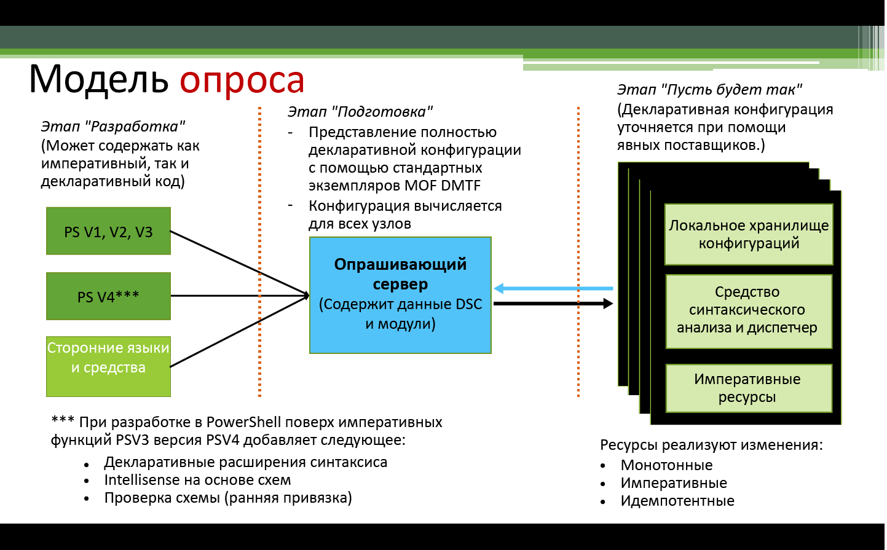

# Применение конфигураций

>Область применения: Windows PowerShell 4.0, Windows PowerShell 5.0

Настройку требуемого состояния PowerShell (DSC) можно применять двумя способами: в режиме принудительной отправки и в режиме опроса.

## Режим принудительной отправки

Режим принудительной отправки означает, что пользователь активно применяет конфигурацию к целевому узлу, вызывая командлет [Start-DscConfiguration](https://technet.microsoft.com/en-us/library/dn521623.aspx).

Созданную и скомпилированную конфигурацию можно применить в режиме принудительной отправки, вызвав командлет [Start-DscConfiguration](https://technet.microsoft.com/en-us/library/dn521623.aspx) и указав в качестве значения параметра -Path для этого командлета путь к MOF-файлу конфигурации. Например, если MOF-файл конфигурации находится в каталоге `C:\DSC\Configurations\localhost.mof`, его можно применить на локальном компьютере, выполнив следующую команду: `Start-DscConfiguration -Path 'C:\DSC\Configurations'`

> __Примечание__. По умолчанию DSC выполняет конфигурацию в фоновом режиме. Для интерактивного выполнения конфигурации вызовите командлет [Start-DscConfiguration](https://technet.microsoft.com/library/dn521623.aspx) с параметром __-wait__.

## Режим опроса

В режиме опроса на опрашивающих клиентах настраивается получение конфигураций требуемого состояния с удаленного опрашивающего сервера. На опрашивающем сервере при этом настраивается размещение службы DSC и производится подготовка с использованием конфигураций и ресурсов, которые требуются опрашивающим клиентам. На каждом опрашивающем сервере задается расписание задачи периодической проверки соответствия для конфигурации узла. При первой активации события локальный диспетчер конфигураций (LCM) на опрашивающем клиенте делает запрос опрашивающего сервера, чтобы получить конфигурацию, указанную в LCM. Если такая конфигурация на опрашивающем сервере есть и проходит начальные проверки допустимости, она передается на опрашивающий клиент, где LCM ее выполняет.

LCM регулярно проверяет, соответствует ли клиент конфигурации, в интервалы, заданные свойством **ConfigurationModeFrequencyMins** LCM. LCM регулярно проверяет наличие обновленных конфигураций на опрашивающем сервере в интервалы, заданные свойством **RefreshModeFrequency** LCM. Дополнительные сведения о настройке LCM см. в разделе [Настройка локального диспетчера конфигураций](metaConfig.md).

Дополнительные сведения о настройке опрашивающего сервера DSC см. в разделе [Настройка опрашивающего веб-сервера DSC](pullServer.md).

Если вы предпочитаете использовать для размещения опрашивающего сервера веб-службу, обратитесь к [службе автоматизации Azure DSC](https://azure.microsoft.com/en-us/documentation/articles/automation-dsc-overview/).

В следующих разделах показано, как настраивать опрашивающие серверы и клиенты:

- [Настройка опрашивающего веб-сервера](pullServer.md)
- [Настройка опрашивающего SMB-сервера](pullServerSMB.md)
- [Настройка опрашивающего клиента](pullClientConfigID.md)

