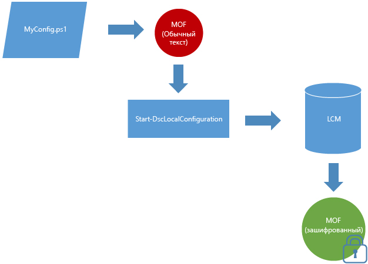

# Документы MOF шифруются по умолчанию

Документы конфигурации содержат конфиденциальную информацию. В предыдущих версиях DSC для обеспечения безопасности учетных данных в конфигурации требовалось распространять сертификаты и управлять ими. У многих эта процедура занимала слишком много времени, и даже после ее реализации оставались незащищенные сведения конфигурации. 

Теперь все изменилось, так как **все MOF-файлы конфигурации защищены по умолчанию**. Не нужно никаких сертификатов или параметров метаконфигураций. Каждый раз, когда локальный диспетчер конфигураций на целевом узле сохраняет MOF конфигурации на диске, этот документ шифруется. Для шифрования MOF-файлов используется [DPAPI](https://msdn.microsoft.com/en-us/library/ms995355.aspx). **Примечание.** MOF-файлы, созданные с помощью сценария конфигурации, не шифруются.

**Пример.** Шифрование в режиме принудительной отправки 

Если вы уже используете метод сертификатов для шифрования паролей или хотите обеспечить дополнительную защиту паролей, [существующий метод шифрования на основе сертификатов](https://msdn.microsoft.com/en-us/powershell/dsc/securemof) продолжит работать. В результате получается документ MOF, который полностью зашифрован с помощью DPAPI, а также содержит зашифрованные пароли.

Такое шифрование применяется только к документам MOF конфигурации (pending.mof, current.mof, previous.mof, а также неполные MOF-файлы). MOF-файлы метаконфигурации по-прежнему сохраняются в виде обычного текста, поскольку они с меньшей вероятностью содержат секретные данные.

<!--HONumber=Aug16_HO3-->

